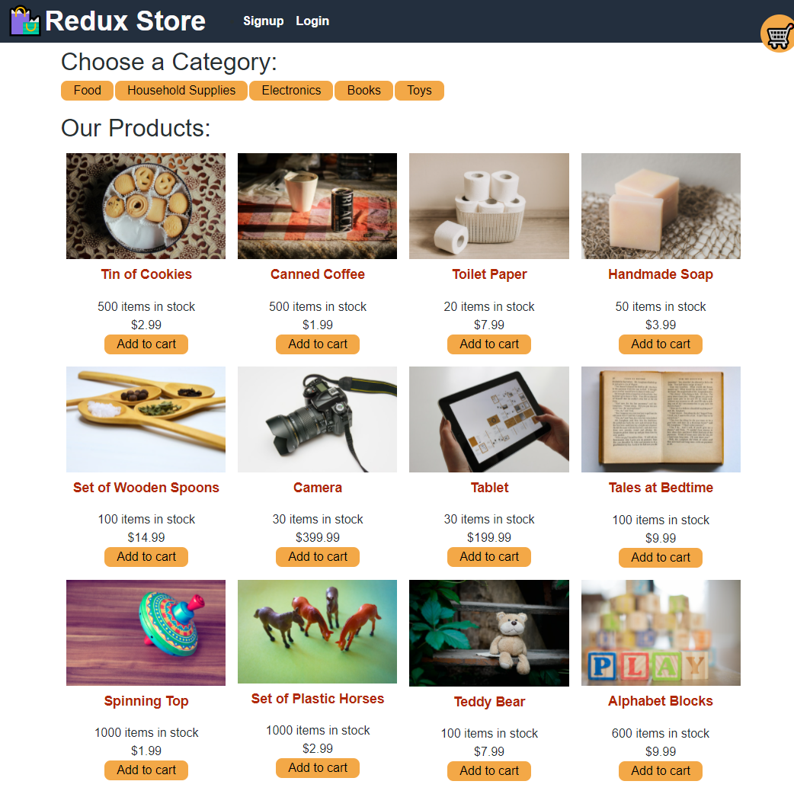

# Redux Store

## Description
---
A MERN stack application e-commerce site that also uses Stripe payments.

[Deployed Application](https://redux-store-95.herokuapp.com/)

Below is a screenshot of the application:

## Table of Contents
---
- [Description](#description)
- [Table of Contents](#table-of-contents)
- [Installation](#installation)
- [Usage](#usage)
- [Contributing](#contributing)
- [Questions](#questions)

## Installation
---
1. Run `npm install`

## Usage
---
1. `npm run seed` to seed the data
2. `npm run start` to start the application
3. The application is deployed on http://localhost:3000/

## Contributing
---
[Richard Lim](https://github.com/lim95)

## Questions
---
Contact me with any questions: [email](mailto:sungjoon.lim@gmail.com) , [GitHub](https://github.com/lim95) 